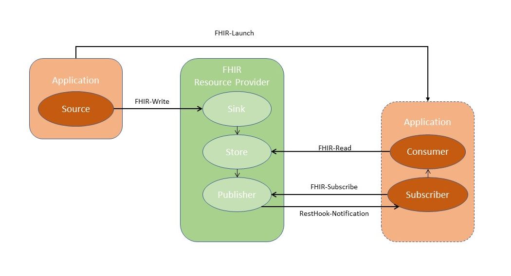

# BAI - Basis Interacties

### De basis principes van REST

* REST geeft elke **resource** een ID (identifier). Alles wat identificeerbaar moet zijn, moet een ID hebben. REST noemt deze identificeerbare dingen 'resources'. Op internet is er een uniek concept voor ID's: de URL. URL's vormen een globale naam en het gebruik van URL's om de belangrijkste resources te identificeren, betekent dat ze een unieke, globale ID krijgen.
* REST is een **client-server**-architectuur. De server manipuleert en slaat informatie op en stelt deze op efficiënte wijze ter beschikking aan gebruikers. De client of afnemer van een dienst neemt die informatie over en toont deze aan de gebruiker en/of gebruikt deze om latere informatie verzoeken uit te voeren. Deze scheiding van taken stelt zowel de client als de server in staat om onafhankelijk verder te evolueren, omdat het hier alleen vereist wordt dat de interface hetzelfde blijft.
* REST zorgt voor een **uniforme interface** tussen de (systeem)componenten. Dit vereenvoudigt de architectuur, omdat alle componenten dezelfde regels volgen om met elkaar te praten. Het maakt het ook gemakkelijker om de interacties tussen de verschillende (systeem)componenten te begrijpen. Om dit goed te bereiken hebben we een aantal randvoorwaarden nodig. Zie de basis CRUD verderop.
* REST gebruikt meerdere **representaties.** Een representatie is een formaat waarin de gegevens worden getransporteerd tussen client-server. Met behulp van HTTP-protocollen kan een client vragen om een weergave in een bepaald formaat. REST staat meerdere representaties voor een resource toe. JSON en XML zijn de gebruikte representaties binnen Koppeltaal.
* REST is **stateless**. Dat betekent dat de communicatie tussen de client en de server altijd alle informatie bevat die nodig is om een aanvraag uit te voeren. Er is geen sessiestatus op de server, deze wordt volledig aan de kant van de client bijgehouden. Als toegang tot een resource authenticatie vereist, dan moet de client zichzelf bij elk verzoek authentiseren, d.m.v. een toegangstoken.

Basis interacties met een server of andere applicatie moeten volledig worden aangestuurd door hypermedia (links-URLs). De client heeft geen voorkennis van de dienst nodig om deze te gebruiken, behalve een toegangspunt (endpoint) en natuurlijk basiskennis van het mediatype van de representaties, in ieder geval voldoende om hyperlinks en linkrelaties te vinden en te identificeren.

Het volgend interactiediagram, beschrijft een data-uitwisselingspatroon waar _alle_ functionele interacties op gebaseerd zijn:



| Actor           | Omschrijving                                                                                                                                                                              |
| --------------- | ----------------------------------------------------------------------------------------------------------------------------------------------------------------------------------------- |
| **Application** | Een (software) toepassing.                                                                                                                                                                |
| **Source**      | Verstuurt nieuwe, gewijzigde en verwijderde FHIR Resources naar de **Sink.**                                                                                                              |
| **Sink**        | Ontvangt nieuwe, gewijzigde en verwijderde FHIR Resources van de **Source**, en slaat deze op in de **Store.**                                                                            |
| **Store**       | Maak opgeslagen resources beschikbaar aan **Consumers**. Elke wijziging in de **Store** wordt ook gemeld aan de **Publisher**.                                                            |
| **Consumer**    | Leest FHIR Resources van de **Store.**                                                                                                                                                    |
| **Subscriber**  | Abonneert zich op het ontvangen van wijziging notificaties door het versturen van een Subscription resource naar de **Publisher**.                                                        |
| **Publisher**   | Verstuurt op basis van resource wijzigingen zoals gemeld door de **Store** en de actieve Subscriptions Notificaties _**met een lege body**_** ** naar de RestHook van de **Subscribers**. |


De FHIR Resource Provider combineert de **Sink**, **Store** en **Publisher**. Elke applicatie kan een combinatie van de technische actoren **Source**, **Consumer** en **Subscriber** implementeren.


### Technische Interacties

| Koppeltaal Interactie    | Omschrijving                                                                                                                                                                                                                                                                                                                                                                                                                                                                                                                                                                                                                                                                                                                                                                                                                                                                                                                                                                                                                                                                                                                                  |
| ------------------------ | --------------------------------------------------------------------------------------------------------------------------------------------------------------------------------------------------------------------------------------------------------------------------------------------------------------------------------------------------------------------------------------------------------------------------------------------------------------------------------------------------------------------------------------------------------------------------------------------------------------------------------------------------------------------------------------------------------------------------------------------------------------------------------------------------------------------------------------------------------------------------------------------------------------------------------------------------------------------------------------------------------------------------------------------------------------------------------------------------------------------------------------------- |
| **FHIR-Write**           | <p>Gebruikt een van de volgende FHIR Interacties (gebaseerd op <a href="http://hl7.org/fhir/http.html">http://hl7.org/fhir/http.html</a>): create, update, delete. </p><p>Elke nieuwe FHIR Resource instantie krijgt door de server een 'resource-origin' element als extensie toegevoegd, waarin bijgehouden wordt wie de originele eigenaar is van de gecreëerde resource instantie. Dit is specifiek voor Koppeltaal uitgewerkt.</p>                                                                                                                                                                                                                                                                                                                                                                                                                                                                                                                                                                                                                                                                                                       |
| **FHIR-Read**            | Gebruikt een van de volgende FHIR Interacties (gebaseerd op [http://hl7.org/fhir/http.html](http://hl7.org/fhir/http.html#search)): search, read, vread                                                                                                                                                                                                                                                                                                                                                                                                                                                                                                                                                                                                                                                                                                                                                                                                                                                                                                                                                                                       |
| **FHIR-Subscribe**       | Dit is een FHIR-Write interactie op de [Subscription](https://www.hl7.org/fhir/r4/subscription.html) resource met [Subscription.channel.payload](https://www.hl7.org/fhir/r4/subscription-definitions.html#Subscription.channel.payload) is null (_**geen body**_).                                                                                                                                                                                                                                                                                                                                                                                                                                                                                                                                                                                                                                                                                                                                                                                                                                                                           |
| **RestHook-Notificatie** | <p>Dit is een notificatie zoals beschreven bij <a href="https://www.hl7.org/fhir/r4/subscription.html#2.46.7.1">REST Hook</a>.</p><p>De REST-Hook channel type geeft aan dat de FHIR Resource Provider een HTTP REST aanvraag naar een FHIR-eindpunt moet maken wanneer een resource verandert die overeenkomt met het opgegeven <a href="https://www.hl7.org/fhir/r4/subscription.html">Subscription</a> resource.</p><p>De FHIR Resource Provider moet de eventuele headers toevoegen aan het POST-verzoek dat hij aan de client doet.</p>                                                                                                                                                                                                                                                                                                                                                                                                                                                                                                                                                                                                  |
| **FHIR-Launch**          | <p>Via de FHIR-Launch interactie kan een applicatie (binnen of buiten de gebruikersinterface) een andere applicatie opstarten.</p><p>Gebruikt een van de volgende FHIR Interacties: launch.<br>Voorbeeld:<br>-GET /application/launch?iss=<a href="https://application/source&#x26;launch=123">https://application/source&#x26;launch=123</a> </p><p>-POST  /application/launch?iss=<a href="https://application/source&#x26;launch=123">https://application/source&#x26;launch=</a>HTI Token<br><br>Bij de 1e omschrijving kan men de SMART App Launch flow volgen, zie <a href="http://hl7.org/fhir/smart-app-launch/app-launch.html#launch-app-ehr-launch">http://hl7.org/fhir/smart-app-launch/app-launch.html#launch-app-ehr-launch</a>.</p><p>Bij de 2e omschrijving MOET het HTIToken digitaal ondertekend worden door de lancerende partij en gevalideerd worden door de gelanceerde partij. De gelanceerde partij kan het HTIToken zelf valideren of kan hiervoor een Token Introspection interface gebruiken. Zie <a href="https://confluence.vzvz.nl/display/KTDOC/Het+token+introspection+endpoint">Token Introspection</a>. </p> |

### De URL opbouw

URL's maken het mogelijk om alle FHIR resource instanties via een netwerk te kunnen identificeren. REST legt de nadruk op een consistent definitie van deze URL's, zodat ze voor zichzelf spreken, intuïtief zijn en gemakkelijk op te bouwen zijn door applicatie instanties. Om tot een consistente manier te komen om URL's te definiëren, moeten ze zorgvuldig worden ontworpen, vandaar hier een paragraaf over de URL opbouw en het gebruik ervan.

Voordat we ingaan op de kern van de URL opbouw, wordt eerst de  verschillende onderdelen van de URL opbouw uitgelegd.\
Een URL heeft de volgende opbouw : schema://domein:poort/pad?query\_string

Waar:

* Het schema definieert de contexttype van de URL, het doel en de syntaxis van het resterende deel van de URL. De software zal proberen een URL te verwerken volgens het schema en de context. Bijvoorbeeld, een webbrowser zal gewoonlijk de verwijzing naar de URL http://voorbeeld.nl:80 verwijderen door een HTTP verzoek uit te voeren aan de host op voorbeeld[.n](http://example.org)l, met poortnummer 80. Andere voorbeelden van schema namen omvatten https:, gopher:, wais:, ftp:.
* Het domein of IP-adres geeft de bestemming locatie voor de URL. Het domein koppeltaal.nl, of het IP-adres aa.bb.ccc.dd, is het adres van de website van Koppeltaal. Het domeinnaamgedeelte van een URL is niet hoofdlettergevoelig omdat DNS hoofdletters negeert: https://koppeltaal\_acc.provider.nl/ en\
  HTTPS://KOPPELTAAL\_ACC.PROVIDER.NL/ openen beide dezelfde pagina.
* De poort is optioneel; indien deze wordt weggelaten, wordt de standaardwaarde voor het schema gebruikt. Bijvoorbeeld, http://vnc.voorbeeld.nl:5800 maakt verbinding met poort 5800 van vnc.voorbeeld.nl, wat geschikt is voor een VNC-afstandsbedieningssessie. Als het poortnummer wordt weggelaten voor een http: URL, maakt de browser verbinding op poort 80, de standaard HTTP-poort. De standaardpoort voor een http**s**: verzoek is 443.
* Het pad wordt gebruikt om de gevraagde (FHIR) resources voor een bepaalde organisatie/zorg afnemer te specificeren en deze te vinden. Deze is wel **hoofdlettergevoelig**, hoewel het door sommige servers als hoofdletterongevoelig kan worden behandeld, vooral die op Microsoft Windows gebaseerd zijn. In het pad kan ook een major versie opgenomen worden zie [Versiebeheer en -beleid](https://confluence.vzvz.nl/pages/viewpage.action?pageId=90888709). Pad voorbeeld: /zorgafnemerXYZ/v3/Patient/1234
* De query\_string bevat gegevens die moeten worden doorgegeven aan software die op de server draait. Het kan naam/waarde-paren bevatten, bijvoorbeeld gescheiden door ampersands first\_name=Koppel\&last\_name=Taal.

#### Belangrijk

Bepaalde karakters zijn in de query\_string NIET toegestaan. Deze MOETEN door een escape sequence, een procentteken "%" gevolgd door twee hexadecimale cijfers (0-9, A-F) die de waarde voor dat karakter (octet waarde) aangeven, vervangen worden.

Zie de volgende BNF notatie voor de query\_string:

schema://domein:poort/pad?**query\_string**

* **query\_string** = xalphas \[ + search ]
* **xalpha =** alpha | digit | safe | extra | escape
* **alpha =** a | b | c | d | e | f | g | h | i | j | k | l | m | n | o | p | q | r | s | t | u | v | w | x | y | z | A | B | C | D | E | F | G | H | I | J | K | L | M | N | O | P | Q | R | S | T | U | V | W | X | Y | Z
* **digit =** 0 |1 | 2 | 3 | 4 | 5 | 6 | 7 | 8 | 9
* **safe =** $ | - | \_ | @ | . | & | + | -
* **extra =** ! | \* | " | ' | ( | ) | ,
* **escape =** % hex hex

Dus bv de karakters ‘**:**’ , ‘**|**’  en  '**=**' MOETEN in de query\_string omgezet worden naar %3A , %7C en %3D, zie de escape (en [asciitable.com](http://asciitable.com) voor translatie).

Voorbeeld:

Van GET https://koppeltaal\_acc.provider.nl/zorgafnemerXYZ/v3/Patient?identifier=urn:oid:2.16.840.1.113883.16.3.4.2.6|KT20-116&#x20;

\=>

Naar GET https://koppeltaal\_acc.provider.nl/zorgafnemerXYZ/v3/Patient?identifier=urn%3Aoid%3A2.16.840.1.113883.16.4.3.2.6%7CKT20-116

### Resource Bundle

Elke interactie die resulteert in, of die een verzameling resources aanbiedt, wordt uitgevoerd via een Resource Bundle mechanisme. Een FHIR Bundle resource is een verzameling resources die gerelateerd zijn, bijvoorbeeld het resultaat van een zoekactie, of een verzameling van historische versie van een resource.

De resource Bundle wordt beschreven in FHIR [http://hl7.org/fhir/R4/bundle.html](http://hl7.org/fhir/R4/bundle.html).

### Content-Type

De Content-Type (HTTP) header wordt gebruikt om het mediatype (of inhoud type) van de resource aan te geven. In reacties vertelt een Content-Type-header de klant wat het content-type van de geretourneerde content eigenlijk is.

De Content-Type is een samengestelde string en bestaat uit

* het media-type (**application/fhir+xml** of **application/fhir+json** content),
* karakter encoding standaard (**utf-8**) en
* de gebruikte FHIR resource versie die uitgewisseld wordt (**fhirVersion=4.0**).

```
Content-Type: application/fhir+json; fhirVersion=4.0; charset=utf-8
```


De FHIR (Resource) Provider ondersteunt alleen utf-8 karakters. Resources die andere karakters bevatten worden afgekeurd of afgewezen.


### Response op interacties

| HTTP header      | Omschrijving                                                                                   | Voorbeeld                                                                                                              |
| ---------------- | ---------------------------------------------------------------------------------------------- | ---------------------------------------------------------------------------------------------------------------------- |
| Content-Location | Absolute URL van de (nieuwe) resource, resource id met verwijzing naar laatste content versie. | [http://koppeltaal.vzvz.nl/R4/Patient/2840276/\_history/1](http://hapi.fhir.org/baseR4/AuditEvent/2840276/\_history/1) |
| Content-Type     | Resource serialization formaat.                                                                | application/fhir+json;charset=utf-8                                                                                    |
| ETag             | Versielabel voor het gebruik van Optimistic concurrency.                                       | W/"1"                                                                                                                  |

